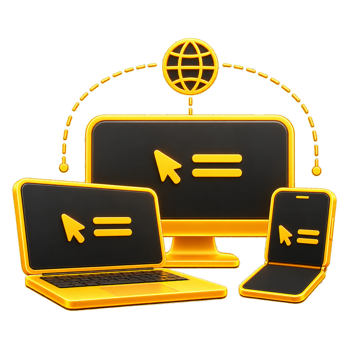
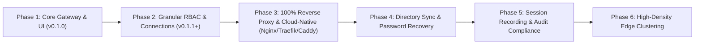

#  RemoteDog — Roadmap & Architecture Plan

This document outlines the strategic roadmap and architectural milestones for **RemoteDog**, focusing on high-performance remote access, granular user-centric access control, and enterprise single sign-on integration.

---

## 🎯 Strategic Milestones

---

## 📌 Phase 2: Granular Connections Manager & Native Protocol Engines *(v0.1.1 – v0.2.0)*

The Connections Manager is unified directly with SQLite RBAC, user profile management, and pure Rust protocol dispatchers.

### 1. User & Protocol Capability Matrix

| Permission & Protocol Category | Configuration Options | Description | Status |
| :--- | :--- | :--- | :--- |
| **Profile Photos** | `Direct SQLite Storage (160×160 WebP)` | 100% portable avatars without filesystem dependencies | ✅ **Completed (v0.1.1)** |
| **Account Protection** | `Username & Display Name` | Edit nickname/email while keeping username immutable | ✅ **Completed (v0.1.1)** |
| **Account Disabling** | `Active / Disabled Status` | Disable users (including default admin) to block logins & sessions | ✅ **Completed (v0.1.1)** |
| **Personal vs Global** | `Scope Isolation & Ownership` | Isolated personal private endpoints + shared global org pools | ✅ **Completed (v0.1.1)** |
| **Interaction Mode** | `Full Interactive`, `View-Only (Observer)` | Observer screen monitoring without input transmission | ✅ **Completed (v0.1.1)** |
| **Clipboard Sync** | `Bidirectional`, `Host-to-Remote`, `Remote-to-Host`, `Disabled` | Enforces clipboard data flow constraints | ✅ **Completed (v0.1.1)** |
| **File Transfer & Dropboxes** | `Full`, `Upload Only`, `Download Only`, `Disabled` | Controls SFTP directory staging and drag-and-drop | ✅ **Completed (v0.1.1)** |
| **Native RDP Engine** | `IronRDP (NLA, CredSSP, TLS, RDPGFX)` | Modern Windows 10/11 native RDP with CredSSP & TLS | ✅ **Completed (v0.2.0)** |
| **High-FPS Tile Diffing** | `64×64 Dirty Sub-Rect Diffing Grid` | 99.8% bandwidth reduction over raw uncompressed framebuffers | ✅ **Completed (v0.2.0)** |
| **Dynamic Resolution** | `MS-RDPEDISP Display Control Channel` | Live remote desktop resolution resize on panel/window change | ✅ **Completed (v0.2.0)** |
| **Performance Presets** | `High Speed`, `Balanced`, `High Quality`, `Custom` | Configurable flags for wallpaper, drag, anim, themes, font smoothing | ✅ **Completed (v0.2.0)** |
| **RDPDR Drive Redirection** | `Native FS Virtual Channel (\\tsclient\Dropbox)` | Redirects staging dropbox directly into Windows Explorer | ✅ **Completed (v0.2.0)** |
| **Panel Reconnect Flow** | `Instant 1-Click Reconnect` | Clean disconnect card with instant reconnection shortcut | ✅ **Completed (v0.2.0)** |
| **Reverse Proxy Usability** | `Subpaths, WSS, Forwarded Headers, ForwardAuth` | 100% flawless operation behind Nginx, Traefik, Caddy, CF Tunnels | 🚀 **Next Roadmap Priority (Phase 3)** |

---

### 2. Global Shared vs. Personal Private Connections

RemoteDog distinguishes between shared organizational resources and personal private tunnels:

* **Global Organizational Connections**:
  * Managed centrally by **Admins**.
  * Assigned to user groups (e.g., `DevOps`, `QA`, `Tier-1 Support`) or individual users.
  * Shared credentials can be encrypted at rest using AES-256-GCM master keys so end-users never see raw passwords or private SSH keys.
* **Personal Private Connections**:
  * Users with `operator` privileges can create their own custom connection endpoints.
  * Private connections are isolated to the creator's workspace.
  * **Admin Governance**: Admins retain administrative oversight, session kill authority, and audit visibility over all personal connections.

---

### 3. Concurrency Limits & Time-Window Scheduling

* **Max Concurrent Sessions**: Enforce per-user and per-connection limits (e.g., max 2 simultaneous RDP sessions per operator).
* **Scheduled Access Windows**: Time-based access rules (e.g., connection active only Monday–Friday, 08:00–18:00 UTC).
* **Automatic Idle Timeout**: Auto-disconnect inactive sessions after configurable thresholds.

---

### 4. Full Audit Trail & Security Telemetry

* **Connection Lifecycle Logs**: Record connection start, duration, client IP, user agent, and clean/forced disconnect reasons.
* **Clipboard Integrity Logging**: Log timestamps, payload byte size, and SHA-256 hashes of clipboard transfers.
* **File Transfer Telemetry**: Full recording of staged uploads and downloads with file names, sizes, and remote destination paths.

---

## 📌 Phase 3: 100% Reverse Proxy Readiness & Cloud-Native Deployment

RemoteDog is committed to being **100% cloud-native and flawlessly deployable behind any enterprise reverse proxy, ingress controller, or zero-trust tunnel** (Nginx, Traefik, Caddy, HAProxy, Envoy, Cloudflare Tunnels, Authentik Outpost, and Kubernetes Ingress).

### 1. Subpath Mounting & Dynamic Base URL (`X-Forwarded-Prefix`)
* **Flexible Subpath Hosting**:
  * Ability to host RemoteDog under root (`https://remote.domain.com/`) or under arbitrary subpaths (e.g. `https://gateway.domain.com/remotedog/` or `https://tools.internal/dog/`).
  * Dynamic asset path resolution in frontend (`app.js`, `style.css`, SVGs, icons) respecting `base_path` configuration and `X-Forwarded-Prefix` headers.
  * Zero redirect loops or broken asset references when accessing with or without trailing slashes.

### 2. WebSocket Tunnel Resiliency Behind Proxies
* **Robust WebSocket Proxy Support**:
  * Flawless handling of `Upgrade: websocket` and `Connection: Upgrade` headers across HTTP/1.1 and HTTP/2/3 ingress gateways.
  * Configurable server-side WebSocket keepalive ping/pong frames to prevent intermediate proxy timeouts (such as Cloudflare's 100-second idle limit or Nginx's default 60-second `proxy_read_timeout`) from terminating active terminal, SSH, or graphical remote desktop sessions.
  * Automatic graceful reconnect and state resumption upon transient network disconnects.

### 3. Forwarded Headers & Real Client IP Resolution
* **Trusted Proxies & CIDR Whitelisting**:
  * Configurable `trusted_proxies` CIDR list (e.g., `10.0.0.0/8`, `172.16.0.0/12`, `192.168.0.0/16`, `127.0.0.1/32`, Cloudflare IP ranges).
  * Accurate client IP extraction from `X-Forwarded-For`, `X-Real-IP`, and `CF-Connecting-IP` headers for rate limiting and security audit trails, preventing IP spoofing.
  * Respect `X-Forwarded-Proto` (`https` vs `http`) and `X-Forwarded-Host` for accurate OIDC redirect URIs and client WebSocket scheme detection (`wss://` vs `ws://`).

### 4. Reverse Proxy Header-Based / Forward Authentication
* **Authentik / Authelia / Traefik ForwardAuth Integration**:
  * Optional trusted header authentication mode (e.g., `X-authentik-username`, `X-authentik-email`, `Remote-User`, `Remote-Email`, `Remote-Groups`).
  * When placed behind an Authentik / Authelia proxy outpost, automatically sign the user into RemoteDog based on validated upstream reverse proxy headers without prompting for duplicate logins.

### 5. Production Reverse Proxy Configuration Recipes
* Provide tested, production-grade drop-in configuration snippets in the repository:
  * **Nginx** (`proxy_pass`, WebSocket headers, buffer sizing, subpath rewrites).
  * **Caddy 2** (`reverse_proxy`, automatic TLS, subpath `handle_path`).
  * **Traefik v3** (Docker labels, IngressRoute, middleware headers).
  * **Cloudflare Tunnel** (`cloudflared` ingress rules with WebSocket enabled).
  * **HAProxy** (`backend` configuration with WebSocket switching).

### 6. Liveness, Readiness & Healthcheck Probes
* Dedicated unauthenticated `/api/health` and `/api/ready` endpoints returning lightweight JSON statuses for Kubernetes container liveness/readiness probes and load-balancer health checks.

---

## 📌 Phase 4: Identity Provider, Directory Sync & Password Recovery

* **Email-Based Password Recovery**:
  * Magic link / one-time reset token emailed to verified user addresses with Argon2id hash update.
* **Authentik / Keycloak / Okta OIDC Sync**:
  * Map Identity Provider group claims (e.g., `groups: ["infra-admins", "remote-viewers"]`) directly to RemoteDog user roles and connection pools.
* **Just-In-Time (JIT) User Provisioning**:
  * Automatically create and configure user profiles upon first successful OIDC login.
* **OAuth2 / WebAuthn / FIDO2 Passkeys**:
  * Hardware security key authentication for PAM and local SQLite accounts.

---

## 📌 Phase 5: Session Recording & Audit Compliance

* **Guacamole `.guac` & Asciinema Replacement**:
  * Terminal session streaming to lightweight `.cast` formats for replay.
  * VNC/RDP tile streaming capture with lossless zstd compression.
* **Built-in Session Player**:
  * Browser-based playback scrubber in the Admin Audit modal.

---

## 📌 Phase 6: High-Density Edge Gateway Clustering

* **Stateless Gateway Nodes**:
  * Scale WebSocket and protocol forwarding across multiple distributed edge nodes.
* **Central Database Sync**:
  * Support for external PostgreSQL and SQLite cluster replication for high-availability deployments.
