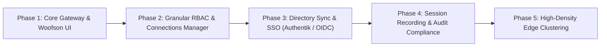

#  RemoteDog — Roadmap & Architecture Plan

This document outlines the strategic roadmap and architectural milestones for **RemoteDog**, focusing on high-performance remote access, granular user-centric access control, and enterprise single sign-on integration.

---

## 🎯 Strategic Milestones

---

## 📌 Phase 2: Granular Connections Manager & User Entitlements

The Connections Manager is being unified directly with SQLite RBAC and user profile management. This enables administrators to define fine-grained security policies per connection, per user, and per group.

### 1. User & Group Permission Matrix

Each connection profile and user assignment supports a comprehensive capability matrix:

| Permission Category | Configuration Options | Description |
| :--- | :--- | :--- |
| **Clipboard Sync** | `Bidirectional`, `Host-to-Remote Only`, `Remote-to-Host Only`, `Disabled` | Enforces clipboard data flow constraints to prevent data exfiltration. |
| **File Transfer & Dropboxes** | `Full (Upload & Download)`, `Download Only`, `Upload Only`, `Disabled` | Controls SFTP directory staging and browser-based file drag-and-drop. |
| **Interaction Mode** | `Full Interactive`, `View-Only (Observer)`, `Shadow / Collaborative` | Allows screen sharing or read-only monitoring without input transmission. |
| **Protocol Entitlements** | `SSH`, `VNC / RFB`, `RDP`, `Local PTY` | Per-user allowlist of accessible gateway protocol engines. |
| **Audio Redirection** | `Enabled`, `Disabled` | RDP and VNC audio channel forwarding. |

---

### 2. Global Shared vs. Personal Private Connections

RemoteDog distinguishes between shared organizational resources and personal private tunnels:

* **Global Organizational Connections**:
  * Managed centrally by **Admins**.
  * Assigned to user groups (e.g., `DevOps`, `QA`, `Tier-1 Support`) or individual users.
  * Shared credentials can be encrypted at rest using AES-256-GCM master keys so end-users never see raw passwords or private SSH keys.
* **Personal Private Connections**:
  * Users with `operator` privileges can create their own custom connection endpoints.
  * Private connections are isolated to the creator's workspace.
  * **Admin Governance**: Admins retain administrative oversight, session kill authority, and audit visibility over all personal connections.

---

### 3. Concurrency Limits & Time-Window Scheduling

* **Max Concurrent Sessions**: Enforce per-user and per-connection limits (e.g., max 2 simultaneous RDP sessions per operator).
* **Scheduled Access Windows**: Time-based access rules (e.g., connection active only Monday–Friday, 08:00–18:00 UTC).
* **Automatic Idle Timeout**: Auto-disconnect inactive sessions after configurable thresholds.

---

### 4. Full Audit Trail & Security Telemetry

* **Connection Lifecycle Logs**: Record connection start, duration, client IP, user agent, and clean/forced disconnect reasons.
* **Clipboard Integrity Logging**: Log timestamps, payload byte size, and SHA-256 hashes of clipboard transfers.
* **File Transfer Telemetry**: Full recording of staged uploads and downloads with file names, sizes, and remote destination paths.

---

## 📌 Phase 3: Identity Provider & Directory Sync

* **Authentik / Keycloak / Okta OIDC Sync**:
  * Map Identity Provider group claims (e.g., `groups: ["infra-admins", "remote-viewers"]`) directly to RemoteDog user roles and connection pools.
* **Just-In-Time (JIT) User Provisioning**:
  * Automatically create and configure user profiles upon first successful OIDC login.
* **OAuth2 / WebAuthn / FIDO2 Passkeys**:
  * Hardware security key authentication for PAM and local SQLite accounts.

---

## 📌 Phase 4: Session Recording & Audit Compliance

* **Guacamole `.guac` & Asciinema Replacement**:
  * Terminal session streaming to lightweight `.cast` formats for replay.
  * VNC/RDP tile streaming capture with lossless zstd compression.
* **Built-in Session Player**:
  * Browser-based playback scrubber in the Admin Audit modal.

---

## 📌 Phase 5: High-Density Edge Gateway Clustering

* **Stateless Gateway Nodes**:
  * Scale WebSocket and protocol forwarding across multiple distributed edge nodes.
* **Central Database Sync**:
  * Support for external PostgreSQL and SQLite cluster replication for high-availability deployments.
